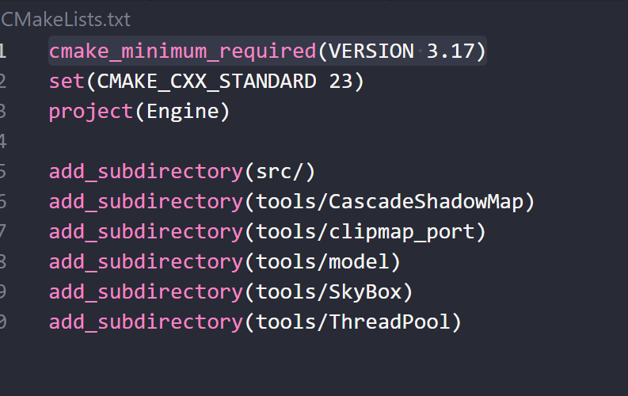
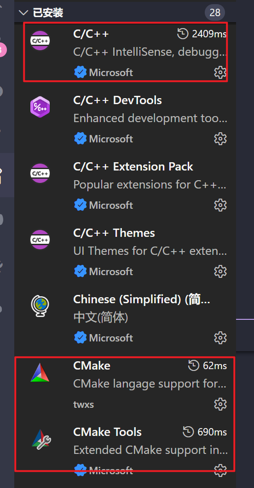
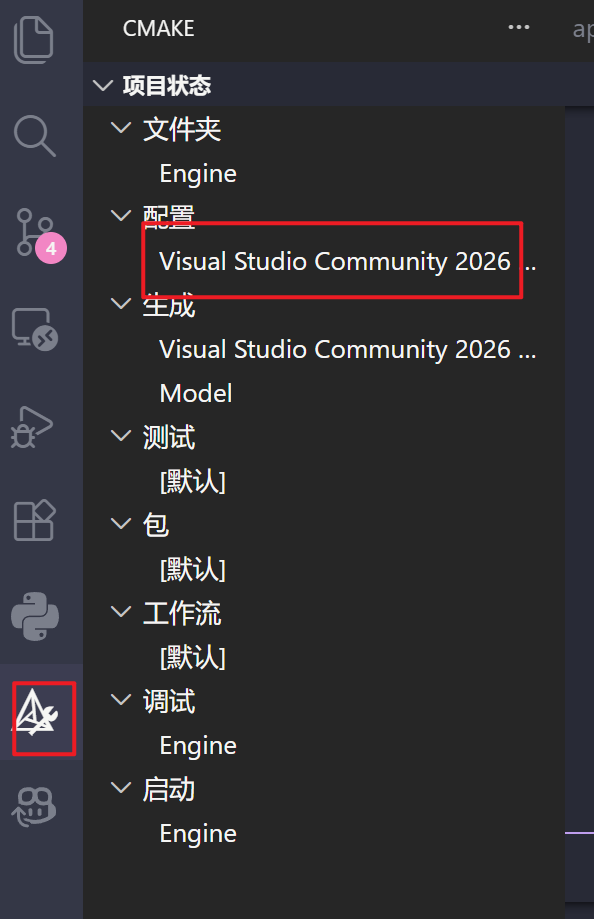
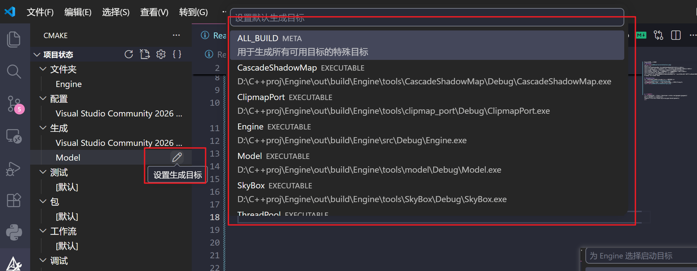
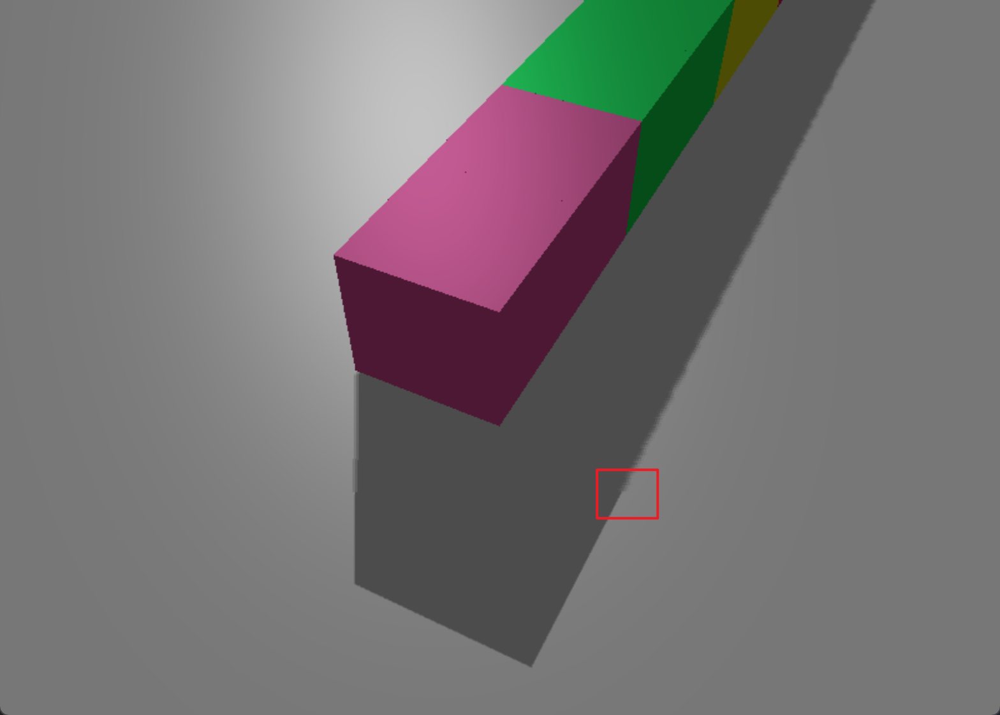
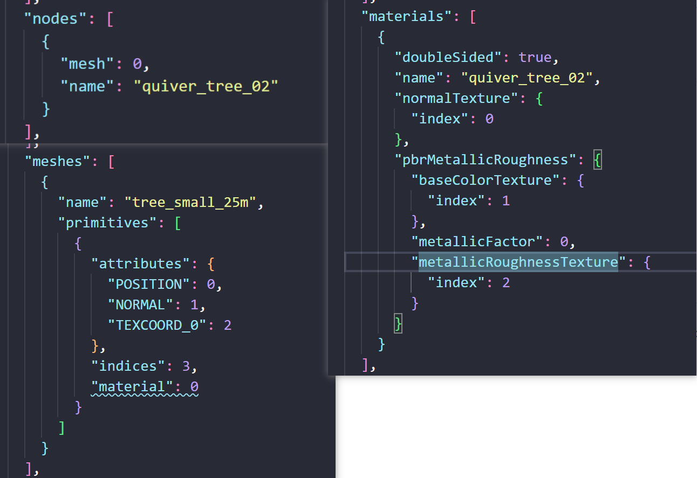
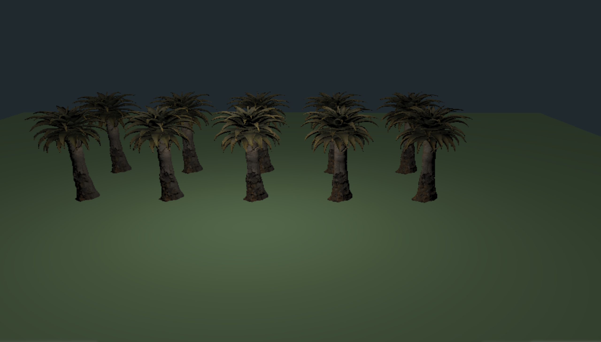
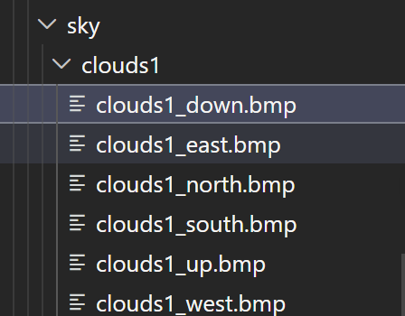

# DirectX 12 渲染引擎项目

这是一个基于 C++23 与 DirectX 12 的实时渲染引擎实验项目，主要用于系统性实践 D3D12 渲染管线封装、大规模地形渲染、级联阴影、glTF 模型导入与实例化绘制等图形技术。项目包含可独立运行的功能验证 Demo，也包含一个集成地形、模型与阴影的主 Engine 工程。

项目内容均基于当前代码仓库实现整理，适合作为简历中的图形渲染/引擎开发项目介绍。

## 项目架构



项目主要分为以下部分：

- `Core/`：封装 D3D12 基础对象与渲染基础设施，包括 Device、Command、SwapChain、DescriptorHeap、RootSignature、PipelineState、Shader、Texture、ConstantBuffer、Mesh、Camera、Model GPU Resource 等模块。
- `src/Engine`：主集成工程，当前集成 Clipmap Terrain、Cascade Shadow Map、Quvier Tree glTF 模型实例化绘制与可见性过滤。
- `tools/CascadeShadowMap`：级联阴影测试工程，用于独立验证 shadow map array、深度写入与场景采样流程。
- `tools/clipmap_port`：Clipmap 大地形渲染测试工程，用于验证地形 LOD 网格、Heightmap 更新与 Debug 显示模式。
- `tools/model`：模型导入测试工程，使用 Assimp 导入 glTF 模型并验证材质纹理与实例绘制流程。
- `tools/SkyBox`：天空盒测试工程，使用 6 张 BMP 纹理构建立方体天空盒。
- `tools/ThreadPool`：线程池测试工程，目前作为独立模块验证，后续可用于资源加载或实例数据处理等任务。

## 技术栈

- 语言与构建：C++23、CMake、MSVC / Clang-CL
- 图形 API：DirectX 12、DXGI、D3DCompiler
- 图像与资源：Windows Imaging Component、Assimp、stb_image
- 渲染技术：Clipmap Terrain、Cascade Shadow Map、Texture2DArray、CBV/SRV/UAV/DSV、Root Signature、Graphics/Compute Pipeline State
- 数据与优化：实例化渲染、基于距离的可见性过滤、基于相机方向的简单背向过滤、Hammersley 低差异序列采样

## 构建方式

项目使用 CMake 管理多个可执行目标。可以在 VS Code 中通过 CMake Tools 插件配置，也可以直接使用命令行。

VS Code 配置流程：



选择支持 DirectX 12 的编译器，推荐使用 MSVC 或 Clang-CL：



选择需要生成的目标工程：



命令行构建示例：

```powershell
cmake -S . -B build
cmake --build build --target Engine --config Debug
```

也可以单独构建测试工程：

```powershell
cmake --build build --target CascadeShadowMap --config Debug
cmake --build build --target ClipmapPort --config Debug
```

## 操作说明

- `W`：前进
- `A`：左移
- `D`：右移
- `Q`：下降
- `E`：上升

## 核心功能

### 1. D3D12 渲染基础封装

项目对 DirectX 12 常用对象进行了面向工程使用的封装，降低业务层直接操作底层 API 的复杂度。当前封装覆盖：

- Device、Factory、SwapChain 与窗口系统初始化。
- CommandQueue、CommandAllocator、GraphicsCommandList 的创建、Reset、Execute 与同步封装。
- DescriptorHeap 与 DescriptorHandle 管理，支持 CBV/SRV/UAV、RTV、DSV 等描述符类型。
- RootSignature 构建，支持 Root CBV、Root Constant、Descriptor Table、Static Sampler 等绑定方式。
- Graphics / Compute PipelineState 创建，统一组织 Shader、InputLayout、Rasterizer、DepthStencil、Blend、RenderTarget 格式等配置。
- Texture、DepthTexture、ConstantBuffer、UploadResource 等资源封装，支持上传堆、默认堆、SRV/DSV/UAV 创建与资源状态转换。

### 2. Clipmap 大地形渲染

`tools/clipmap_port` 与主 `Engine` 中实现了基于 Clipmap 思路的大范围地形渲染流程：

- 使用多层 Clipmap LOD 表示大范围地形，每层根据摄像机位置维护 level offset。
- 通过 `GroundMesh` 生成静态网格块与 draw list，运行时根据摄像机位置更新绘制区域。
- 使用 `Heightmap` 管理地形高度数据更新，并通过 Texture2DArray 组织不同 Clipmap 层级的高度纹理。
- 主工程中使用 compute shader 更新地形高度纹理，再在 terrain shader 中进行高度采样与渲染。
- 支持通过宏配置 Clipmap 层级数量与基础网格尺寸。

Clipmap 测试工程提供多种显示模式：

- 按键 `1`：显示原始地形。
- 按键 `2`：显示 Clipmap 网格地形。
- 按键 `3`：同时显示原始地形与网格地形。

演示：


### 3. Cascade Shadow Map 级联阴影

项目实现了级联阴影的独立 Demo 与主工程集成：

- 使用摄像机视锥分段计算多级 cascade light view-projection 矩阵。
- 使用 D32 深度纹理数组保存多层 shadow map。
- 在 shadow pass 中通过 Geometry Shader 写入不同 array slice。
- 在 terrain 与 model 渲染 pass 中采样 cascade shadow map，实现地形与模型的阴影接收。
- 通过 Root CBV / Descriptor Table 绑定场景常量、级联阴影常量、地形高度纹理与 shadow map。

CascadeShadowMap 独立测试工程用于验证级联边界与阴影采样：


细节图：



### 4. glTF 模型导入与实例化绘制

模型模块使用 Assimp 导入 glTF 格式资源，并在主工程中用于 Quvier Tree 模型实例化绘制：

- 封装 `ModelAsset` 与 `ModelGpuResource`，将模型顶点、索引、材质纹理转换为 GPU 可绘制资源。
- 当前 Quvier Tree 模型包含 node、mesh 与多张材质纹理，主渲染 shader 中包含 base color、normal、metallic-roughness 等纹理采样流程。
- 使用实例数据描述模型世界位置，并通过实例化渲染减少重复 draw 配置。
- 使用 Hammersley 低差异序列生成候选实例位置，再映射到地形高度数据获取世界坐标。
- 主工程默认宏 `QUVIER_TREE_NUM_DEFAULT` 控制候选实例数量，当前默认值为 `3000000`。

模型 Demo：





### 5. 实例可见性过滤

主 Engine 中针对 Quvier Tree 实例实现了 CPU 侧过滤流程，避免将明显不可见的实例全部提交给 GPU：

- 使用 `QUVIER_TREE_VISIBLE_DISTANCE` 控制实例可见距离，默认值为 `600.0f`。
- 根据实例位置与摄像机位置计算距离，剔除超过可见范围的实例。
- 根据实例相对摄像机方向与摄像机前向向量的夹角余弦，过滤摄像机背后的实例。
- 该方法不是完整视锥剔除，但实现简单，适合作为当前项目中实例提交前的轻量级过滤策略。

### 6. SkyBox 与 ThreadPool 测试模块

SkyBox 工程通过 6 张 BMP 图片构建立方体天空盒，用于验证天空盒贴图加载与渲染流程：




ThreadPool 当前作为独立测试模块保留，后续可用于资源加载、实例生成或 CPU 侧数据预处理等任务。

## 主 Engine 集成效果

主 `Engine` 当前集成：

- Clipmap Terrain 大范围地形渲染。
- Cascade Shadow Map 阴影生成与采样。
- Quvier Tree glTF 模型导入、实例数据生成与实例化绘制。
- 基于距离与摄像机方向的实例过滤。
- 可通过宏控制地形层级、候选实例数量与可见距离。

演示：


## 关键配置宏

当前主工程中部分参数可通过宏控制，适合在 CMake 中通过 `target_compile_definitions()` 覆盖：

- `CLIPMAP_LEVEL_NUM`：Clipmap 层级数量，默认 `10`。
- `QUVIER_TREE_NUM_DEFAULT`：Quvier Tree 候选实例数量，默认 `3000000`。
- `QUVIER_TREE_VISIBLE_DISTANCE`：Quvier Tree 可见距离，默认 `600.0f`。
- `CLIPMAP_BLOCK_UNIT`：Clipmap 基础网格块尺寸，默认 `64`。
- `SHADOW_MAP_WIDTH` / `SHADOW_MAP_HEIGHT`：级联阴影图分辨率，默认 `2048 x 2048`。
- `SHADOW_CASCADE_COUNT`：级联阴影层数，默认 `5`。

地形尺寸由 Clipmap 参数推导：

```text
TERRIAN_SIZE =
((CLIPMAP_LEVEL_RESOLUTION - 1) * CLIPMAP_MAX_LEVEL_STEP * CLIPMAP_LEVEL0_SCALE)
```

在当前默认参数下：

```text
CLIPMAP_LEVEL_RESOLUTION = 4 * 64 - 1 = 255
TERRIAN_SIZE = 254 * 2^9 * 1.0 = 130048
TERRIAN_RADIUS = 65024
```

## 简历可用描述

DirectX 12 实时渲染引擎项目，基于 C++23 / D3D12 实现渲染基础设施封装，并集成 Clipmap 大地形、Cascade Shadow Map、glTF 模型导入与实例化绘制等功能。项目包含多个独立验证 Demo 与主 Engine 集成工程，覆盖从底层资源管理到高层渲染效果组合的完整实践流程。

可用于简历的要点描述：

- 封装 DirectX 12 渲染基础模块，包括 Device、CommandList、SwapChain、DescriptorHeap、RootSignature、PipelineState、Shader、Texture、ConstantBuffer 等对象，支持图形与计算管线创建。
- 实现基于 Clipmap 的大范围地形渲染流程，根据摄像机位置更新多层 LOD 网格与高度纹理，并通过 compute shader 更新地形高度数据。
- 实现 Cascade Shadow Map 阴影方案，使用深度纹理数组保存多级 shadow map，并在地形与模型渲染中进行级联阴影采样。
- 接入 Assimp glTF 模型导入流程，构建模型 GPU 资源，并完成 Quvier Tree 模型的实例化渲染。
- 使用 Hammersley 低差异序列生成候选实例位置，并结合距离过滤与相机背向过滤减少实例提交量。
- 通过 CMake 管理主工程与多个独立 Demo 工程，便于模块化验证 Clipmap、级联阴影、模型导入、天空盒与线程池等功能。

## 后续计划

- 将 SkyBox 模块进一步集成到主 Engine，作为地形与模型场景的环境背景。
- 尝试加入 MSAA 或其他抗锯齿方案，改善几何边缘显示质量。
- 将 ThreadPool 用于资源加载、实例生成或 CPU 侧可见性过滤流程。
- 进一步完善实例剔除策略，例如引入更标准的视锥剔除或层级空间划分结构。
- 优化 tools 与 Engine 的模块依赖关系，减少测试工程头文件对主工程的隐式影响。

## 参考资料

- [1] GPU Gems 2：Terrain Rendering Using GPU-Based Geometry Clipmaps
  https://developer.nvidia.com/gpugems/gpugems2/part-i-geometric-complexity/chapter-2-terrain-rendering-using-gpu-based-geometry
- [2] AMD / Arm Clipmap Terrain 示例
  https://arm-software.github.io/opengl-es-sdk-for-android/terrain.html
- [3] LearnOpenGL：Cascade Shadow Mapping
  https://learnopengl.com/Guest-Articles/2021/CSM
- [4] Fractal Brownian Motion 参考资料
  https://www.shader-learn.com/zh/learn/noise/fractal-brownian-motion
